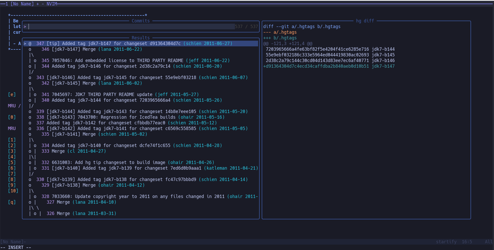

# telescope-hg.nvim

This is an extension for [telescope.nvim][] provides some [mercurial] operation. Can't find one so this is a simple one that scratch my own itch.

[mercurial]: https://www.mercurial-scm.org/
[telescope.nvim]: https://github.com/nvim-telescope/telescope.nvim



## Installation

```
Plug 'nvim-lua/plenary.nvim'
Plug 'nvim-telescope/telescope.nvim'
Plug 'jackysee/telescope-hg'
```

```
lua require'telescope'.load_extension('hg')
```

## Usage

### files

`:Telescope hg files` show files managed by hg. Untracked files would be shown by defualt. Use `:Telescope hg files show_untracked=false` to disable it.

Mappings: 
- `<cr>` to select file

### status

`:Telescope hg status` show changed files.

Mappings:
- `<cr>` to select file

### log

`:Telescope hg log` show rev history of entire repo

Mappings:
- `<cr>` to checkout the revision

### logthis

`:Telescope hg logthis` show rev history of current buffer

Mappings:
- `<cr>` vertical diff rev to buffer
- `<c-r>` revert to the revision

### branches

`:Telescope hg branches` list repo named branches

Mappings:
- `<cr>` checkout the target branch

